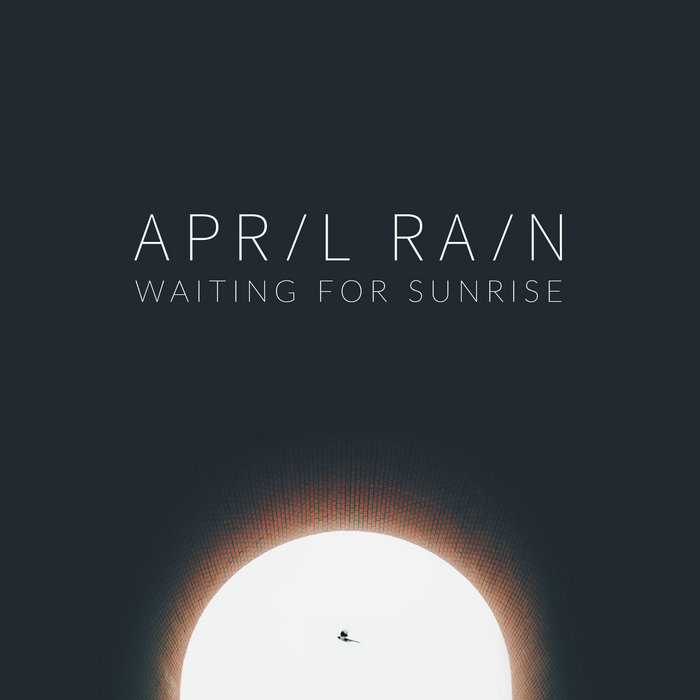

# April Rain Full album

## About April rain band
April Rain is an instrumental rock band that started out as a one-man band in Krasnodon, Ukraine. First full line-up played two gigs in Lugansk then a new one was formed after the founder moved to Saint-Petersburg, Russia. The band's discography consists of six LPs and two EPs.

### developed a QR-code to join the telegram channel that contain full album of this band with ``React.js framework``

## this channel contain these albums :
- Undertone
- Mirror of Ether
- Seven Summer Days: Noir OST
- To Whom it May Concern
- Leave Me No Light
- One Is Glad To Be Of Service
- Waiting For Sunrise
- Songs for Someone Ep
- A melting Snowman Ep
